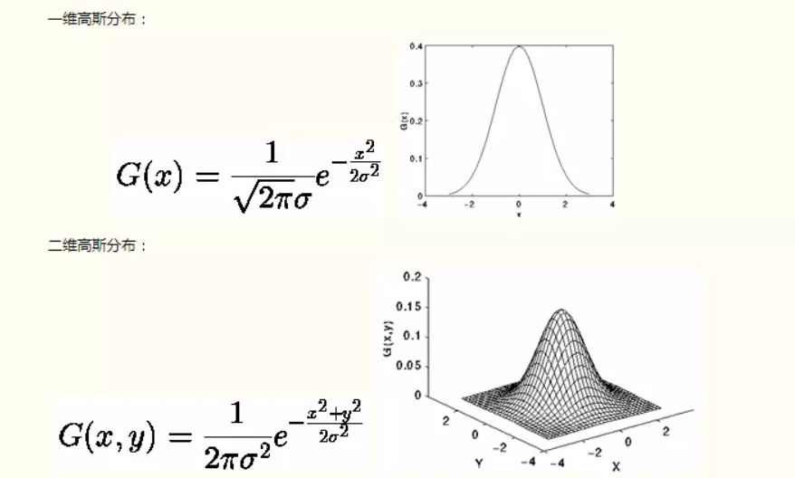
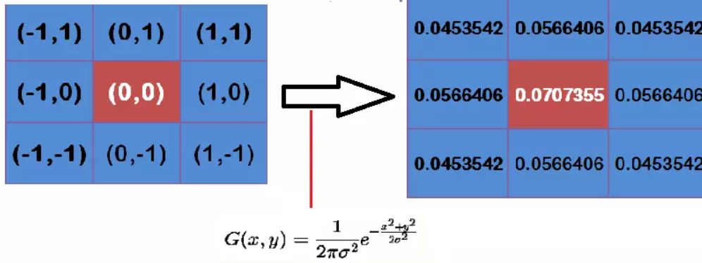
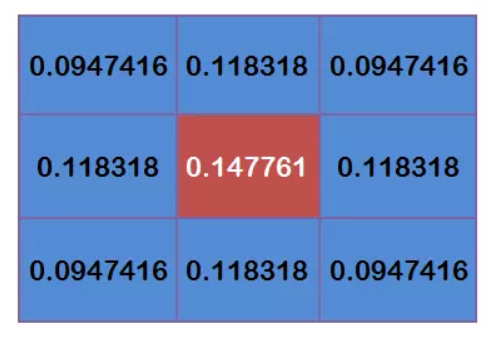

[TOC]

# 传统图像处理

## 001 颜色空间介绍

- **RGB**
- **HSI**
- **CMYK**
- **YUV**

## 002 高斯滤波

> 先引入两个问题。
>  1.图像为什么要滤波？
>  答：a.消除图像在数字化过程中产生或者混入的噪声。
>  b.提取图片对象的特征作为图像识别的特征模式。
>  2.滤波器该如何去理解?
>  答：滤波器可以想象成一个包含加权系数的窗口或者说一个镜片，当使用滤波器去平滑处理图像的时候，就是把通过这个窗口或者镜片去看这个图像。

滤波器分为很多种，有方框滤波、均值滤波、高斯滤波等。

**高斯滤波是一种线性平滑滤波，适用于消除高斯噪声。**所以在讲高斯滤波之前，先解释一下什么是高斯噪声？

**1 高斯噪声**

首先，**噪声**在图像当中常表现为一引起较强视觉效果的孤立像素点或像素块。简单来说，噪声的出现会给图像带来干扰，让图像变得不清楚。
**高斯噪声**就是它的概率密度函数服从高斯分布（即正态分布）的一类噪声。如果一个噪声，它的幅度分布服从高斯分布，而它的功率谱密度又是均匀分布的，则称它为高斯白噪声。高斯白噪声的二阶矩不相关，一阶矩为常数，是指先后信号在时间上的相关性。

**高斯滤波器是根据高斯函数的形状来选择权值的线性平滑滤波器**
 所以接下来再讲解一下高斯函数和高斯核。

**2 高斯函数**

注：σ的大小决定了高斯函数的宽度。

**3 高斯核**

理论上，高斯分布在所有定义域上都有非负值，这就需要一个无限大的卷积核。实际上，仅需要取均值周围3倍标准差内的值，以外部份直接去掉即可。
 **高斯滤波的重要两步就是先找到高斯模板然后再进行卷积**，模板（mask在查阅中有的地方也称作掩膜或者是高斯核）。所以这个时候需要知道它怎么来？又怎么用？
 举个栗子：
 假定中心点的坐标是（0,0），那么取距离它最近的8个点坐标，为了计算，需要设定σ的值。假定σ=1.5，则模糊半径为1的高斯模板就算如下

 这个时候我们我们还要确保这九个点加起来为1（这个是高斯模板的特性），这9个点的权重总和等于0.4787147，因此上面9个值还要分别除以0.4787147，得到最终的高斯模板。

**4 高斯滤波计算**

有了高斯模板，那么高斯滤波的计算便顺风顺水了。
举个栗子：假设现有9个像素点，灰度值（0-255）的高斯滤波计算如下：

参考来源：（https://blog.csdn.net/nima1994/article/details/79776802）

将这9个值加起来，就是中心点的高斯滤波的值。
 对所有点重复这个过程，就得到了高斯模糊后的图像。

**5 高斯滤波步骤**

综上可以总结一下步骤：

> （1）移动相关核的中心元素，使它位于输入图像待处理像素的正上方
>  （2）将输入图像的像素值作为权重，乘以相关核
>  （3）将上面各步得到的结果相加做为输出
>  **简单来说就是根据高斯分布得到高斯模板然后做卷积相加的一个过程。**

**参考资料**

- [简单易懂的高斯滤波](https://www.jianshu.com/p/73e6ccbd8f3f)
- [图像滤波之高斯滤波介绍](https://www.cnblogs.com/qiqibaby/p/5289977.html)

## 003 腐蚀和膨胀

- [ ] TODO

## 004 开运算和闭运算

- [ ] TODO

## 005 线性插值

- [ ] TODO

## 006 双线性插值

- [ ] TODO

## 007 仿射变换

- [ ] TODO

## 008 透视变换

- [ ] TODO

## 009 介绍常见的边缘检测算子

- [ ] TODO

## 010 介绍Sobel算法

- [ ] TODO

## 011 介绍Canny算法

- [ ] TODO

## 012 Hough变换原理（直线和圆检测）

- [ ] TODO

## 013 找轮廓（findCountours）

- [ ] TODO

## 014 单应性（homography）原理

TODO

## 015 二维高斯滤波能否分解成一维操作

答：可以分解。

二维高斯滤波分解为两次一维高斯滤波，高斯二维公式可以推导为X轴与Y轴上的一维高斯公式。

即使用一维高斯核先对图像逐行滤波，再对中间结果逐列滤波。

**参考资料**

- [快速高斯滤波、高斯模糊、高斯平滑(二维卷积分步为一维卷积)](https://blog.csdn.net/qq_36359022/article/details/80188873)

## 016 介绍HOG算法

- [ ] TODO

## 017 怎么理解图像的频率

- [ ] TODO

## 018 双边滤波

- [ ] TODO

## 019 图像中的低频信息和高频信息

图像频率：图像中灰度变化剧烈程度的指标

- 低频信息（低频分量）表示图像中灰度值变化缓慢的区域，对应着图像中大块平坦的区域。
- 高频信息（高频分量）表示图像中灰度值变化剧烈的区域，对应着图像的边缘（轮廓）、噪声以及细节部分。

低频分量：主要对整幅图像强度的综合度量

高频分量：主要对图像边缘和轮廓的度量

从傅里叶变换的角度，将图像从灰度分布转化为频率分布。

**参考资料**

- [理解图像中的低频分量和高频分量](https://blog.csdn.net/Chaolei3/article/details/79443520)

## 020 引导滤波

**参考资料**

- [【拜小白opencv】33-平滑处理6——引导滤波/导向滤波（Guided Filter）](https://blog.csdn.net/sinat_36264666/article/details/77990790)

## 021 介绍分水岭算法

- [ ] TODO

## 022 介绍RANSAC算法

- [ ] TODO

## 023 介绍Bundle Adjustment（BA）算法

- [ ] TODO

## 024 介绍L-M算法

- [ ] TODO

## 025 介绍SIFT算法

- [ ] TODO

## 026 介绍SURF算法

- [ ] TODO

## 027 介绍ORB算法

- [ ] TODO

## 028 介绍LSD算法

- [ ] TODO

## 029 介绍LBP算法

- [ ] TODO

## 030 如何求一张图片的均值？

- [ ] TODO

## TODO